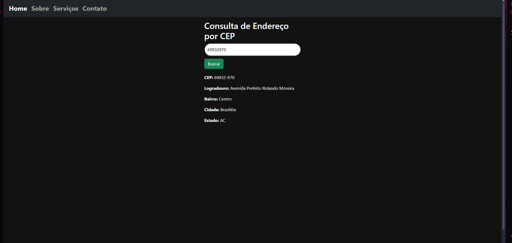

📦 Consulta Fácil

Consulta Fácil é uma aplicação web desenvolvida como parte de um processo seletivo para uma empresa júnior. Ela permite ao usuário consultar dados completos de um endereço a partir de um CEP, exibindo informações como cidade, estado e logradouro. Além disso, conta com uma rota de contato onde visitantes podem enviar seu nome, e-mail e opinião, com os dados sendo armazenados em um banco de dados hospedado em um container Docker.

🚀 Funcionalidades
- • 🔍 Consulta de informações completas por CEP (rua, bairro, cidade, estado)
- • 📬 Rota de contato com formulário (nome, e-mail, opinião)
- • 💾 Armazenamento de dados em banco de dados via Docker
- •🐳 Banco de dados rodando via container Docker
- •🌐 Interface web responsiva e acessível

🧰 Tecnologias Utilizadas
- •HTML, CSS e TypeScript
- •API ViaCEP
- •Node.js + Express (Back-end)
- •MySQL (Banco de dados)
- •Docker

  

  

  

